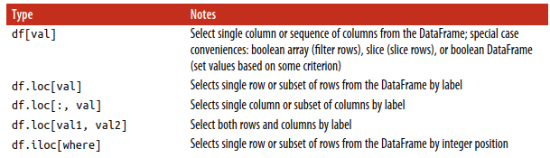
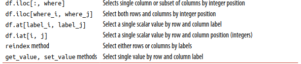
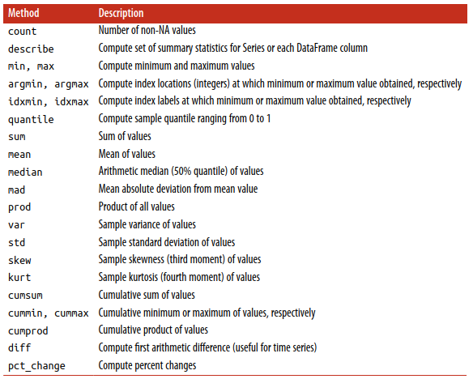
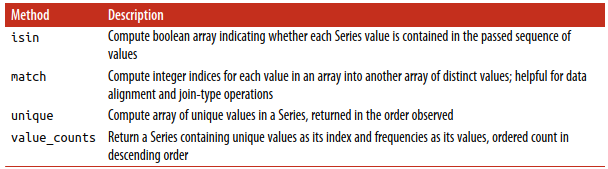

# pandas
[pandas - Python Data Analysis Library](https://pandas.pydata.org/)  
pandas is a fast, powerful, flexible and easy to use open source data analysis and manipulation tool.  
[pandas-dev/pandas](https://github.com/pandas-dev/pandas)

《Python for Data Analysis》

## Data structures
- Series  
  index + values
- DataFrame  
  The DataFrame has both a row and column index; it can be thought of as a dict of Series all sharing the same index.  
  对 Jupyter 有 HTML 显示
- Index Objects  
  immutable  
  label 可以重复，选取时会选取 label 对应的所有行。

就感觉到非常的灵活

## General functions
[General functions --- pandas 1.4.1 documentation](https://pandas.pydata.org/docs/reference/general_functions.html)
- Data manipulations
  - [cut](https://pandas.pydata.org/docs/reference/api/pandas.cut.html)
    ```python
    pd.cut(df['Age'][df['Survived'] == 1], bins=range(0, 101, 10), right=False).value_counts(sort=False)
    ```

## Series
[Series --- pandas 1.4.1 documentation](https://pandas.pydata.org/docs/reference/series.html)

## DataFrame
[DataFrame --- pandas 1.4.1 documentation](https://pandas.pydata.org/docs/reference/frame.html)
- Indexing, iteration

    
  

  `Series[]` 选取列，或通过 bool 数组选取行  
  `Series.loc[]` 选取行，或通过 bool 数组选取列，或同时选取行列
  - `obj[obj > 0]` 的实现是先通过 `[obj > 0]` 生成 bool Series list，再应用到 `obj` 上
  - slice 包括 end-point

- Reindexing / selection / label manipulation
  - [reindex()](https://pandas.pydata.org/docs/reference/api/pandas.Series.reindex.html)  
    Conform Series to new index with optional filling logic.  
    method: { None, 'backfill'/'bfill', 'pad'/'ffill', 'nearest' }

- Binary operator functions

  

- Computations / descriptive stats

  

  
