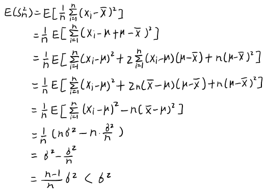

# Variance
Population variance:
$$\sigma^2={1\over n}\Sigma_{i=1}^n{(x_i-\mu)^2}$$

Biased sample variance:
$$S^2_n={1\over n}{(X_i-\bar{X})^2}$$

Unbiased sample variance:
$$S^2={1\over n-1}{(X_i-\bar{X})^2}$$
or
$$S^2={1\over n}{(X_i-\mu)^2}$$

## Bessel's correction
注意到，以 $n$ 为分母得到的样本方差 $S^2_n$ 是方差 $\sigma^2$ 的有偏估计：  

为了得到方差的无偏估计，我们需要将上式乘以 ${n\over n-1}$，得到
$$S^2={1\over n-1}{(X_i-\bar{X})^2}$$
该修正被称为 **Bessel's correction (贝塞尔修正)**。

出现这一现象的根本原因是， $\bar{X}$ 是从随机变量得来的统计量， $n$ 个随机变量只含有 $n-1$ 个距离 $\bar{X}$ 的偏差信息（即自由度为 $n-1$），而方差是偏差的平均，对于 $n-1$ 个偏差信息就需要以 $n-1$ 为分母；而如果将 $\bar{X}$ 替换为 $\mu$， $n$ 个随机变量就含有 $n$ 个偏差信息了，此时分母为 $n$ 是无偏的。