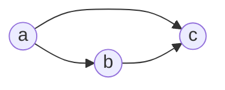

# Directed Probabilistic Graphical Models
In **Bayesian networks (directed graphical models)**, the links of the graphs have a particular directionality indicated by arrows.

Given an arbitrary joint distribution $p(a,b,c)$ over three variables $a$, $b$ and $c$. By application of the product rule of probability, we can write the joint distribution in the form

$$p(a,b,c)=p(c|a,b)p(a,b)$$

A second application of the product rule, this time to the second term on the righthand side, gives

$$p(a,b,c)=p(c|a,b)p(b|a)p(a)$$

Note that this decomposition holds for any choice of the joint distribution. We say that this graph is fully connected because there is a link between every pair of nodes.

It is the absence of links in the graph that conveys interesting information about the properties of the class of distributions that the graph represents.

The joint distribution defined by a graph is given by the product, over all of the nodes of the graph, of a conditional distribution for each node conditioned on the variables corresponding to the parents of that node in the graph. Thus, for a graph with $K$ nodes, the joint distribution is given by

$$p(x)=\prod_{k=1}^K{p(x_k|pa_k)}$$

where $pa_k$ denotes the set of parents of $x_k$, and $x=\{x_1,\cdots,x_K\}$. This key equation expresses the factorization properties of the joint distribution for a directed graphical model.[^prml]

The **Markov blanket** of a node $x_i$ comprises the set of parents, children and co-parents of the node. It has the property that the conditional distribution of $x_i$, conditioned on all the remaining variables in the graph, is dependent only on the variables in the Markov blanket. We can think of the Markov blanket of a node $x_i$ as being the minimal set of nodes that isolates $x_i$ from the rest of the graph.[^prml]

[^prml]: Bishop, Christopher M., and Nasser M. Nasrabadi. Pattern Recognition and Machine Learning. Vol. 4. 4. Springer, 2006.