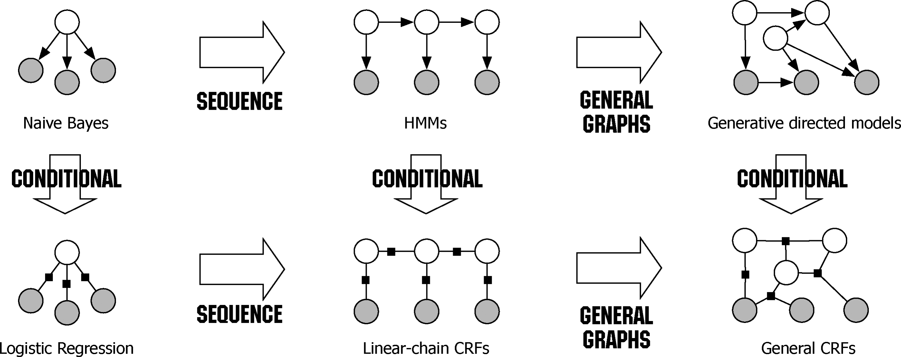

# 使用线性条件随机场实现中文分词
## 条件随机场
记 $X$ 为要标记数据的随机变量， $Y$ 为标记的随机变量。设 $G=(V,E)$ 为一个图，且 $Y=(Y_v)_{v\in V}$，即可通过 $V$ 索引到 $Y$。如果以 $X$ 为条件， $Y_v$ 的条件概率只受邻居影响，即满足马尔可夫性质：
$$p(Y_v|X,\{Y_w:w\ne v\})=p(Y_v|X,\{Y_w:w\sim v\})$$
其中 $w\sim v$ 表示 $w\sim v$ 为邻居，那么 $(X,Y)$ 就是一个**条件随机场（conditional random field，CRF）**。

若 $G$ 为一条链，即 $G=(V=\{1,2,\cdots,m\},E=\{(i,i+1)\})$，则称对应的条件随机场为**线性条件随机场（linear-chain CRF）**。给定 $X$ 序列 $x$，此时 $Y$ 序列 $y$ 的联合分布为

$$p_\theta(y|x)={1\over Z(x)}\exp(\sum_{e\in E,k_1}\lambda_{k_1} f_{k_1}(e,y|_e,x) + \sum_{v\in V,k_2} \mu_{k_2} g_{k_2}(v,y|_v,x))$$

其中参数 $\theta=(\lambda_1,\lambda_2,\cdots;\mu_1,\mu_2,\cdots)$， $f_k$ 和 $g_k$ 为给定的特征函数， $y|_S$ 表示 $y$ 中与子图 $S$ 的顶点相关联的部件（边或者顶点）， $Z$ 为一个正规化函数。

我们也可以将该联合分布变换为以下形式：

$$p_\theta(y|x)={1\over Z(x)}\exp(\sum_{e\in E,k=1}^{k=k_1+k_2}w_k F_k(e,y|_e,x))$$

其中

$$\begin{equation}
w_k=\{
\begin{aligned}
& \lambda_k, &\quad k=1,2,\cdots,k_1 \\
& \mu_{k-k_1} &\quad k=k_1+1,k_1+2,\cdots,k_1+k_2
\end{aligned}
\end{equation}$$

$$\begin{equation}
F_k(e,y|_e,x)=\{
\begin{aligned}
& f_k(e,y|_e,x), &\quad k=1,2,\cdots,k_1 \\
& g_{k-k_1}(V(e),y|_{V(e)},x) &\quad k=k_1+1,k_1+2,\cdots,k_1+k_2
\end{aligned}
\end{equation}$$

其中 $V(e)$ 表示边 $e$ 某一固定方向的顶点。从该联合分布可以看出，线性条件随机场实际上是一种对数线性模型，这也是我选择条件随机场作为本次作业的原因。

联合分布的参数 $\theta$ 可由给定的训练数据 $D=\{(x^{(i)},y^{(i)})\}_{i=1}^N$ 和经验分布函数 $\tilde{p}(x,y)$，通过最大似然估计确定：

$$O(\theta)=\sum_{i=1}^N \log p_\theta(y^{(i)}|x^{(i)}) \propto \sum_{x,y} \tilde{p}(x,y)\log p_\theta(y|x)$$

如果取特征函数 $f_{k_1}$ 和 $g_{k_2}$ 为

$$\begin{align}
f_{y',y}(<u,v>,y|_{u,v},x)&=\delta(y_u,y')\delta(y_v,y) \\
g_{y,x}(v,y|_v,x)&=\delta(y_v,y)\delta(x_v,x)
\end{align}$$

我们实际上就得到了一个类似隐马尔可夫模型的模型。从这个角度来看，条件随机场可以看作是隐马尔可夫模型的一种推广。

条件随机场与其它模型间也存在着一定联系：



## 实现中文分词
线性条件随机场可在给定 $X$ 序列的情况下寻找相应的最优 $Y$ 序列，如果我们将中文句子作为 $X$ 序列，将词语的边界作为 $Y$ 序列，我们就可以用线性条件随机场实现对中文句子进行分词。例如，我们可以通过一个 $X$ 序列 $(\text{我},\text{就},\text{读},\text{于},\text{东},\text{京},\text{大},\text{学})$ 找到相应的 $Y$ 序列 $(\text{词首},\text{词首},\text{词中},\text{词首},\text{词首},\text{词中},\text{词中},\text{词中},\text{词中},\text{词中})$，进而得到分词结果 $(\text{我},\text{就读},\text{于},\text{东京大学})$。

接下来的问题是，我们该如何选取特征函数？一个字属于词首还是词中，受这个字本身和前后汉字的影响。设当前标记为 $y_k$，当前汉字为 $x_k$，我们可以首先选取以下特征函数族：

$$\begin{equation}
f(y_k,x_k)=\{
\begin{aligned}
& 1, \quad y_k=y_0 \land x_k=x_0 \\
& 0, \quad \text{其它}
\end{aligned}
\end{equation}$$

其中 $y_0$ 表示任一标记，$x_0$ 表示任一汉字。类似的，我们对当前汉字的前后各两个汉字也选取同样的特征函数族。同时，在单字特征之外，我们也需要选取一些多字特征，例如：

$$\begin{equation}
f(y_k,x_k,x_{k+1})=\{
\begin{aligned}
& 1, \quad y_k=y_0 \land x_k=x_0 \land x_{k+1}=x_1 \\
& 0, \quad \text{其它}
\end{aligned}
\end{equation}$$

当前汉字与下一个汉字、当前汉字与前一个汉字、当前汉字与前后各一个汉字、当前汉字与前两个汉字、当前汉字与后两个汉字，我们一共选取五个多字特征函数族，加上单字特征函数族一共为十个特征函数族。

接下来，我们使用 [CRF++](https://taku910.github.io/crfpp/)，一个高性能 CRF 实现，来训练和测试我们的模型。

根据我们选取的特征函数，编写出 CRF++ 的特征函数模板：
```
U00:%x[-2,0]  
U01:%x[-1,0]  
U02:%x[0,0]  
U03:%x[1,0]  
U04:%x[2,0]  
U05:%x[-2,0]/%x[-1,0]/%x[0,0]  
U06:%x[-1,0]/%x[0,0]/%x[1,0]  
U07:%x[0,0]/%x[1,0]/%x[2,0]  
U08:%x[-1,0]/%x[0,0]  
U09:%x[0,0]/%x[1,0]

B
```

这里我们选取了 Second International Chinese Word Segmentation Bakeoff 中的 Microsoft Research 语料库，并进行预处理，得到如下格式的训练数据：
```
“ S  
人 B  
们 E  
常 S  
说 S  
生 B  
活 E  
是 S  
一 S  
部 S
教 B
...
```
其中 B、M、E、S 分别表示词首、词中、词尾和单字词，使用四种标记信息有助于提高模型性能。

使用 CRF++ 训练模型：
```
Number of sentences: 86918  
Number of features: 4336468  
Number of thread(s): 8  
Freq: 3  
eta: 0.00010  
C: 4.00000  
shrinking size: 20
iter=0 terr=0.69015 serr=1.00000 act=4336468 obj=5615142.33459 diff=1.00000  
iter=1 terr=0.42524 serr=0.99211 act=4336468 obj=4455762.93959 diff=0.20647  
iter=2 terr=0.34052 serr=0.98701 act=4336468 obj=2645579.09150 diff=0.40626  
iter=3 terr=0.32337 serr=0.98552 act=4336468 obj=2200094.53245 diff=0.16839  
iter=4 terr=0.53436 serr=0.99338 act=4336468 obj=1998350.62646 diff=0.09170
...
iter=793 terr=0.00245 serr=0.04840 act=4336468 obj=63782.26093 diff=0.00014  
iter=794 terr=0.00242 serr=0.04815 act=4336468 obj=63769.63504 diff=0.00020  
iter=795 terr=0.00244 serr=0.04838 act=4336468 obj=63764.25506 diff=0.00008  
iter=796 terr=0.00243 serr=0.04826 act=4336468 obj=63759.88927 diff=0.00007  
iter=797 terr=0.00243 serr=0.04818 act=4336468 obj=63755.47336 diff=0.00007  
  
Done!17881.80 s
```

回到本节开头的例子，我们尝试使用该模型对 $(\text{我},\text{就},\text{读},\text{于},\text{东},\text{京},\text{大},\text{学})$ 进行标记：
```
我 B S  
就 B B  
读 B E  
于 B S  
东 B B  
京 B M  
大 B M  
学 B E
```
分词结果为 $(\text{我},\text{就读},\text{于},\text{东京大学})$，与我们的预期效果一致。

接下来，使用 Second International Chinese Word Segmentation Bakeoff 中的评分标准进行测试：
```
...
中华								中华
文化								文化
的								的
对话								对话
。								。
INSERTIONS:	1
DELETIONS:	0
SUBSTITUTIONS:	1
NCHANGE:	2
NTRUTH:	45
NTEST:	46
TRUE WORDS RECALL:	0.978
TEST WORDS PRECISION:	0.957
=== SUMMARY:
=== TOTAL INSERTIONS:	1413
=== TOTAL DELETIONS:	1274
=== TOTAL SUBSTITUTIONS:	2417
=== TOTAL NCHANGE:	5104
=== TOTAL TRUE WORD COUNT:	106873
=== TOTAL TEST WORD COUNT:	107012
=== TOTAL TRUE WORDS RECALL:	0.965
=== TOTAL TEST WORDS PRECISION:	0.964
=== F MEASURE:	0.965
=== OOV Rate:	0.026
=== OOV Recall Rate:	0.649
=== IV Recall Rate:	0.974
##	msr_test4crf.tag2word.utf8	1413	1274	2417	5104	106873	107012	0.965	0.964	0.965	0.026	0.649	0.974
```
模型的 F-score 为 $96.5\%$，召回率为 $97.4\%$，分词性能较为良好。

## 总结
通过本次实验，我对条件随机场有了初步了解，对线性对数模型加深了认识，并实现了基于线性条件随机场的中文分词，为如何将模型应用于实际问题积累了经验。

## 参考文献
- Lafferty, John D., Andrew McCallum, and Fernando C. N. Pereira. “Conditional Random Fields: Probabilistic Models for Segmenting and Labeling Sequence Data.” In _Proceedings of the Eighteenth International Conference on Machine Learning_, 282–89. ICML ’01. San Francisco, CA, USA: Morgan Kaufmann Publishers Inc., 2001.
- Sutton, Charles. “An Introduction to Conditional Random Fields.” _Foundations and Trends® in Machine Learning_ 4, no. 4 (2012): 267–373. [https://doi.org/10.1561/2200000013](https://doi.org/10.1561/2200000013).
- “中文分词入门之字标注法4 – 我爱自然语言处理.” https://www.52nlp.cn/中文分词入门之字标注法4.
- Emerson, Thomas. “The Second International Chinese Word Segmentation Bakeoff.” In _Proceedings of the Fourth SIGHAN Workshop on Chinese Language Processing_, 2005. [https://aclanthology.org/I05-3017](https://aclanthology.org/I05-3017).