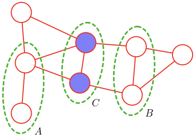

# Undirected Probabilistic Graphical Models
A **Markov random field (Markov network, undirected graphical model)** has a set of nodes each of which corresponds to a variable or group of variables, as well as a set of links each of which connects a pair of nodes. The links are undirected, that is they do not carry arrows.[^prml]

## Conditional independence properties
Suppose that in an undirected graph we identify three sets of nodes, denoted $A$, $B$, and $C$, and that we consider the conditional independence property

$$A\text{⫫}B | C$$

To test whether this property is satisfied by a probability distribution defined by a graph we consider all possible paths that connect nodes in set $A$ to nodes in set $B$. If all such paths pass through one or more nodes in set $C$, then all such paths are ‘blocked’ and so the conditional independence property holds. However, if there is at least one such path that is not blocked, then the property does not necessarily hold, or more precisely there will exist at least some distributions corresponding to the graph that do not satisfy this conditional independence relation.

An alternative way to view the conditional independence test is to imagine removing all nodes in set $C$ from the graph together with any links that connect to those nodes. We then ask if there exists a path that connects any node in $A$ to any node in $B$. If there are no such paths, then the conditional independence property must hold.[^prml]

[^prml]: Bishop, Christopher M., and Nasser M. Nasrabadi. Pattern Recognition and Machine Learning. Vol. 4. 4. Springer, 2006.