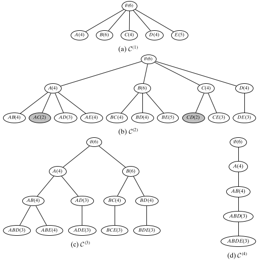

# Itemset Mining
## Brute-force Algorithm
1. Candidate generation: Enumerate all the possible itemsets $X\subset I$.
2. Support computation: For each subset determine its support in the input dataset $D$.

Time complexity: $O(|I|\cdot |D|\cdot 2^{|I|})$

## Level-wist Approach: Apriori Algorithm
$$sup(subset)\ge sup(X)\ge sup(superset)$$

- If itemset $X$ is frequent, then any subset $Y\subset X$ is also frequent.
- If itemset $X$ is not frequent, then any superset $Y \supset X$ cannot be frequent.

Time complexity: $O(|I|\cdot |D|\cdot 2^{|I|})$