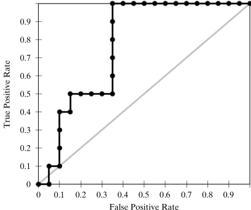

# Receiver Operating Characteristic Analysis
**ROC analysis** plots the performance of the classifier over all possible values of the threshold parameter $\rho$. A ROC curve indicates the extent to which the classifier ranks positive instances higher than the negative instances.

  
(The gray ROC curve is for random classfiers)

The **area under the ROC curve (AUC)** can be used as a measure of classifier performance. The AUC value is essentially the probability that the classifier will rank a random positive test case higher than a random negative test instance.

## ROC 分析可以用于决策树吗？
决策树是 nonparametric 的，怎么取不同的 $\rho$ ？

改变从叶节点的二分类比例中选取结果的阈值？可不管阈值怎么变，难道还能不选比例大的而选比例小的吗？