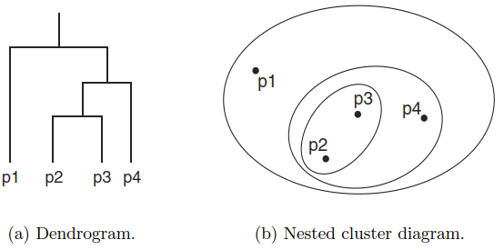

# Hierarchical Clustering
**Hierarchical clustering** refers to a collection of closely related clustering techniques that produce a hierarchical clustering by starting with each point as a singleton cluster and then repeatedly merging the two closest clusters until a single, all encompassing cluster remains. 将簇作为聚类的对象是层次聚类法的基本原理。

Some of these techniques have a natural interpretation in terms of graph-based clustering, while others have an interpretation in terms of a prototype-based approach.

There are two basic approaches for generating a hierarchical clustering:
- Agglomerative  
  Start with the points as individual clusters and, at each step, merge the closest pair of clusters. This requires defining a notion of cluster proximity.
- Divisive  
  Start with one, all-inclusive cluster and, at each step, split a cluster until only singleton clusters of individual points remain. In this case, we need to decide which cluster to split at each step and how to do the splitting.

  
A hierarchical clustering is often displayed graphically using a tree-like diagram called a *dendrogram*, which displays both the cluster-subcluster relationships and the order in which the clusters were merged (agglomerative view) or split (divisive view). For sets of two-dimensional points, a hierarchical clustering can also be graphically represented using a *nested cluster diagram*.