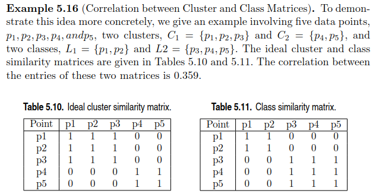

# External Measures
Let $C$ denote the obtained clustering, $T$ denote the ground-truch clustering.

The contingency table $N$ is defined as follows:

$$N(i,j)=n_{ij}=|C_i\cap T_j|$$

Let $n_i=|C_i|$ denote the number of points in cluster $C_i$, $m_j=|T_j|$ denote the number of points in partition $T_j$.

## Matching based measures
为什么 purity 是 external measure？因为我们是用每一个 cluster 中的真实 class label 进行计算的。也就是说，cluster 为计算限定了范围，label 为计算提供了 class。

另一种思路则是让 cluster 提供 predicted class，按照评估分类的方法进行评估。

### Purity
The purity of cluster $C_i$ is:

$$purity_i=\frac{1}{n_i}\max^k_{j=1}\{n_{ij}\}$$

The purity of clustering $C$ is defined as the weighted sum of the clusterwise purity values:

$$purity=\sum_{i=1}^r\frac{n_i}{n}purity_i = \frac{1}{n}\sum_{i=1}^r\max_{j=1}^k\{n_{ij}\}$$

Range: $purity\le 1$
- A purity value of 1 indicates a perfect clustering.

### F-measure
Let $j_i$ denote the partition that contains the maximum number of points from $C_i$, that is, $j_i=\max_{j=1}^k\{n_{ij}\}$.

The precision of a cluster $C_i$ is the same as its purity:

$$prec_i=\frac{1}{n_i} \max_{j=1}^k \{n_{ij}\} = \frac{n_{ij_i}}{n_i}$$

The recall of cluster $C_i$ is defined as:

$$recall_i=\frac{n_{ij_i}}{|T_{j_i}|}=\frac{n_{ij_i}}{m_{j_i}}$$

The F-measure is the harmonic mean of the precision and recall values for each cluster:

$$F_i=\frac{2}{\frac{1}{prec_i}+\frac{1}{recall_i}}=\frac{2n_{ij_i}}{n_i+m_{j_i}}$$

The F-measure for the clustering $C$ is the mean of clusterwise F-measure values:

$$F=\frac{1}{r}\sum_{i=1}^r F_i$$

## Entropy-based measures
### Conditional entropy
The entropy of a clustering $C$ is:

$$H(C)=-\sum_{i=1}^r p_{C_i}\log p_{C_i}$$

where $P_{C_i}=\frac{n_i}{n}$ is the probability of cluster $C_i$.

The entropy of a partitioning $T$ is:

$$H(T)=-\sum_{j=1}^k p_{T_j}\log p_{T_j}$$

where $P_{T_j}=\frac{m_j}{n}$ is the probability of partition $T_j$.

The cluster-specfic entropy of $T$, that is, the conditional entropy of $T$ with respect to cluster $C_i$ is:

$$H(T|C_i)=-\sum_{j=1}^k (\frac{n_{ij}}{n_i})\log\frac{n_{ij}}{n_i}$$

The conditional entropy of $T$ given clustering $C$ is then defined as the weighted sum:

$$\begin{align}
H(T|C)&=-\sum_{i=1}^r\sum_{j=1}^k p_{ij} \log(\frac{p_{ij}}{p_{C_i}}) \\
&= H(C,T) - H(C)
\end{align}$$

where $p_{ij}=\frac{n_{ij}}{n}$ is the probablity that a point in cluster $i$ also belongs to partition $j$, $H(C,T)=-\sum_{i=1}^r\sum_{j=1}^k p_{ij}\log p_{ij}$ is the joint entropy of $C$ and $T$.

Range: $0\le H(T|C) \le \log k$

## Pairwise measures
If  both $x_i$ and $x_j$ belong to the same cluster, that is, $\hat{y_i}=\hat{y_j}$, we call it a **positive** event, and a **negative** event otherwise.

- True Positives ( $M_{11}$ )
  $$TP=|\{(x_i,x_j): y_i=y_j \land \hat{y_i}=\hat{y_j}\}|$$
- False Negatives ( $M_{10}$ )
  $$FN=|\{(x_i,x_j):y_i=y_j \land \hat{y_i}\ne\hat{y_j}\}|$$
- False Positives ( $M_{01}$ )
  $$FP=|\{(x_i,x_j):y_i\ne y_j \land \hat{y_i}=\hat{y_j}\}|$$
- True Negatives ( $M_{00}$ )
  $$TN=|\{(x_i,x_j):y_i\ne y_j \land \hat{y_i}\ne\hat{y_j}\}|$$

Binary Similarity Measures:
- Jaccard coefficient
- Rand statistics (SMC)

## Correlation measures
### Hubert's $\Gamma$ statistic
The **ideal cluster similarity matrix** has a 1 in the $ij$ entry if two objects, $i$ and $j$, are in the same cluster and 0, otherwise.

The **class similarity matrix** has a 1 in the $ij$ entry if two objects, $i$ and $j$, belong to the same class, and a 0 otherwise.

We can take the correlation of these two matrices as the measure of cluster validity.

Example:  

