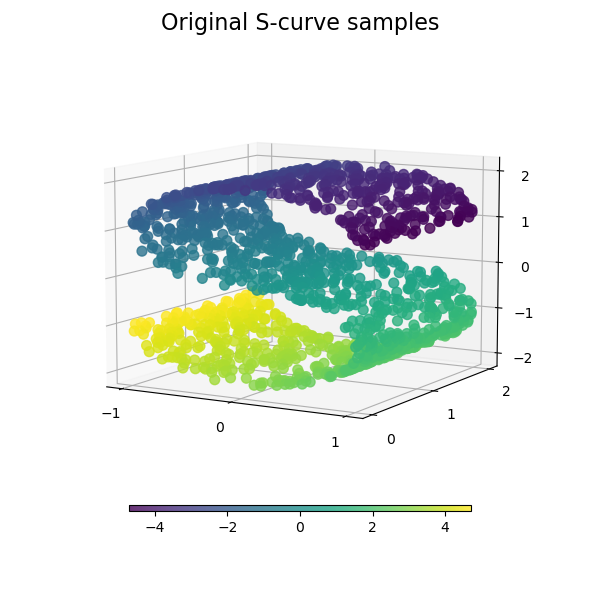

# Manifold Learning
**Manifold（流形）** 是可以局部欧几里得空间化的一种拓扑空间，而 **Manifold learning（流形学习）** 则是一类通过 Manifold 实现的非线性降维方法。

在欧几里得空间中，任意两点间都可以直接求出欧几里得距离，这使得使用欧几里得空间的降维方法在降维时可能会丢失原始结构信息。例如，在对上图所示的S曲面进行降维时，S的右上沿与S的中右部的欧几里得距离很短，它们在降维后就会被放置在相距较近的位置，这样一来，原始的S型结构就被破坏了。

而如果使用 Manifold learning，由于 Manifold 只能够进行局部欧几里得空间化，S的右上沿与S的中右部的距离变为了大约两倍的S的宽度，这样就有可能在降维后仍然保持S型结构了，也就实现了非线性降维。