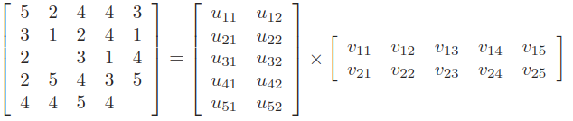

# UV-Decomposition

## Root-mean-square error
$$RMSE=\sqrt{ \frac{\sum_{a_{ij}\ne\phi}(a_{ij}-b_{ij})^2}{|\{a_{ij}|a_{ij}\ne\phi\}|} }$$

1. Sum over all nonblank entries in $M$ the square of the difference between that entry and the corresponding entry in the product $UV$
2. Take the mean of these squares by dividing the number of nonblank entries in $M$
3. Take the square root of the mean
