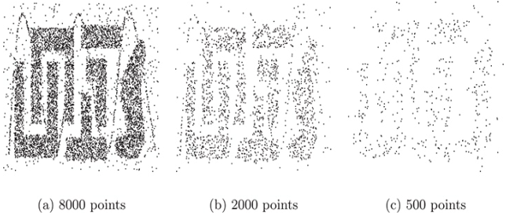
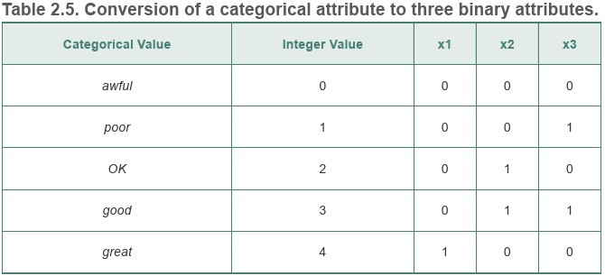

# Data Preprocessing
- Selecting data objects and attributes
- Creating/changing the attributes

## Aggregation
Combine two or more objects into a single object.

优点：
- 节省计算资源
- 提供更高的视角
- 性质更加稳定

缺点：
- 丢失细节

## Sampling
**Sampling** is a commonly used approach for selecting a subset of the data objects to be analyzed.

A sample is representative if it has approximately the same property (of interest) as the original set of data.

优点：
- 节省计算资源

缺点：
- 性质更加不稳定
  
  

Approaches:
- Simple random sampling
  - Simpling without replacement（简单不放回抽样）
  - Simpling with replacement（简单放回抽样）
- Stratified sampling
- Progressive sampling

## [→Demensionality reduction](Dimensionality Reduction/README.md)

## Feature subset selection
- Redundant features
- Irrelevant features

Approaches:
- Embedded approaches
  
  During the operation of the data mining algorithm, the algorithm itself decides which attributes to use and which to ignore.
- Filter approaches
  
  Features are selected before the data mining algorithm is run, using some approach that is independent of the data mining task.
- Wrapper approaches
  
  These methods use the target data mining algorithm as a black box to find the best subset of attributes, in a way similar to that of the ideal algorithm described above, but typically without enumerating all possible subsets.

## Feature weighting
More important features are assigned a higher weight, while less important features are given a lower weight.

## Feature creation
- Feature extraction
- Mapping the data to a new space
  - Fourier transform
  
    
  - Wavelet transform

## Discretization
It is often necessary to transform a continuous attribute into a categorical attribute.

A basic distinction between discretization methods for classification is whether class information is used (supervised) or not (unsupervised).
- Unsupervised discretization
  - Equal width
  - Equal frequency (Equal depth)
  - K-means
  
  
- Supervised discretization
  - Entropy-based approaches

## Binarization
Both continuous and discrete attributes may need to be transformed into one or more binary attributes.

To five asymmetric binary attributes:

## Variable transformation
A variable transformation refers to a transformation that is applied to all the values of a variable.
- Simple functional transformations
  
  In statistics, variable transformations, especially sqrt, log, and 1/x, are often used to transform data that does not have a Gaussian (normal) distribution into data that does.
- Normalization (Standardization)
  
  If different variables are to be used together, e.g., for clustering, then such a transformation is often necessary to avoid having a variable with large values dominate the results of the analysis.