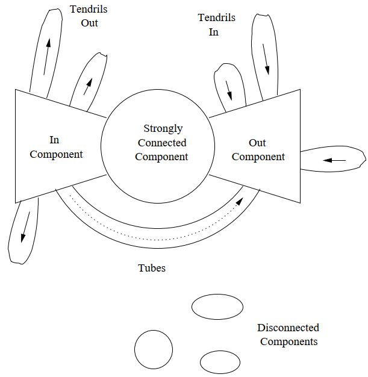

# Web Graph

- Strongly connected component
- In-component
- Out-component
- Tendrils
  - Tendrils in: pages able to reach the out-component but not reachable from the out-component
  - Tendrils out: pages reachable from the in-component but not able to reach the in-component
- Tubes: pages reachable from the in-component and able to reach the out-component, but unable to reach the SCC or be reached from the SCC
- Isolated components
