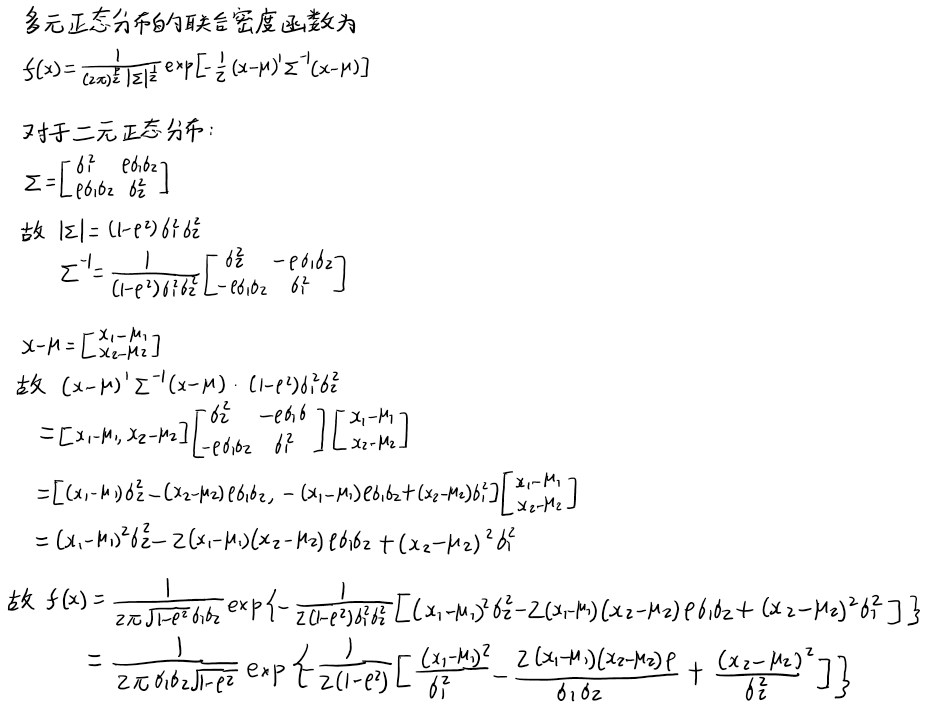
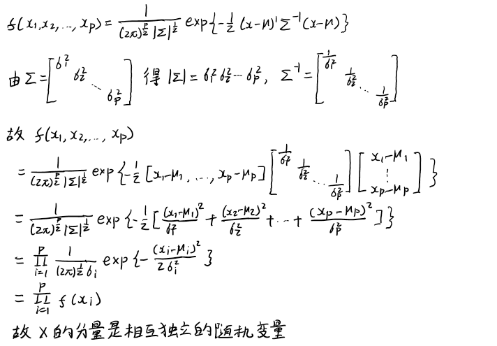

# Multivariate Normal Distribution
Probability density funtion of the univariate normal distribution $N(\mu,\sigma^2)$:
$$f(x)=\frac{1}{\sqrt{2\pi\sigma^2}} e^{-\frac{(x-\mu)^2}{2\sigma^2}}$$

Multivariate normal density of the multivariate normal distribution $N_p(\mathbf{\mu},\mathbf{\Sigma})$:

$$f(\mathbf{x})=
\frac{1}{(2\pi)^\frac{p}{2} |\mathbf{\Sigma}|^\frac{1}{2}}
e^{-\frac{1}{2}(\mathbf{x}-\mathbf{\mu})' \mathbf{\Sigma}^{-1} (\mathbf{x}-\mathbf{\mu})}
$$

二元正态分布的联合密度函数

设 $\mathbf{X}=[X_1,X_2]'$ 服从二元正态分布，利用参数 $\mu_1=E(X_1)$、 $\mu_2=E(X_2)$、 $\sigma_1=\sqrt{D(X_1)}$、 $\sigma_2=\sqrt{D(X_2)}$、 $\rho={Cov(X_1,X_2)\over \sigma_1\sigma_2}$ 来表示 $\mathbf{X}$ 的联合密度。

解：  

若正态随机变量的协方差阵是对角阵，则它的分量是相互独立的随机变量

如果正态随机向量 $\mathbf{X}=(x_1,x_2,\cdots,x_p)'$ 的协方差阵 $\mathbf{\Sigma}$ 是对角阵，证明 $\mathbf{X}$ 的分量是相互独立的随机变量

证明：  

## Maximum likelihood estimation of $\mathbf{\mu}$ and $\mathbf{\Sigma}$
Let $\mathbf{X_1},\mathbf{X_2},...,\mathbf{X_n}$ be a random sample from a normal population with mean $\mathbf{\mu}$ and covariance $\mathbf{\Sigma}$. Then

$$\begin{align}
\hat{\mathbf\mu}&=\bar{\mathbf{X}}
\\
\hat{\mathbf\Sigma}&=
\frac{1}{n}
\Sigma_{j=1}^n
{(\mathbf{X}_j-\bar{\mathbf X})}
{(\mathbf{X}_j-\bar{\mathbf X})'}
\\
&=\frac{1}{n} A
=\frac{n-1}{n}\mathbf S
\end{align}
$$

where

$$
S=\frac{1}{n-1}
\Sigma_{j=1}^n
{(\mathbf{X}_j-\bar{\mathbf X})}
{(\mathbf{X}_j-\bar{\mathbf X})'}
=\frac{1}{n-1} A
$$

## The sampling distribution of $\bar{\mathbf X}$ and $\mathbf S$
In the univariate case, $\bar{X} \sim N(\mu,\frac 1 n \sigma^2)$;  
In the multivariate case, $\bar{\mathbf X} \sim N(\mathbf\mu,\frac 1 n \mathbf\Sigma)$.

In the univariate case, $\frac{n-1}{\sigma^2}S^2 \sim \chi^2(n-1)$, where $\chi^2$ is the *chi-squared distribution*.  
In the multivariate case, $(n-1)\mathbf{S} \sim W_{n-1}(\cdot|\mathbf\Sigma)$, where $W$ is the *Wishart distribution*.