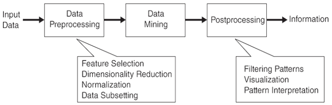

# Multivariate Statistics
Multivariate statistics is a subdivision of statistics encompassing the simultaneous observation and analysis of more than one outcome variable.[^wiki] It can be applied to[^applied]:
- Data reduction or structural simplification
- Sorting and grouping
- Investigation of the dependence among variables
- Prediction
- Hypothesis construction and testing

Terminology

Multivariate statistics vs data mining vs machine learning:
- Data mining is a process of searching, extracting and analyzing (that may include) discovering various types of text graphic patterns (as calligraphic for example), language and literary figures, stylistics, in large amounts of textual or mixed visual and textual data sets, that also involves methods at the intersection of machine learning, formal linguistics analyses as textual statistics, and database systems.[^dm-wiki]
- Machine learning is the study of computer algorithms that can improve automatically through experience and by the use of data. Data mining is a related field of study, focusing on exploratory data analysis through unsupervised learning.[^ml-wiki]
- Machine learning is partly a buzzword for applied statistics and the distinction between statistics and machine learning is often blurry.[^vs-tim]
- 谈到对数据进行分析利用，很多人会想到“数据挖掘”(data mining) ，这里简单探讨一下数据挖掘与机器学习的联系。数据挖掘领域在二十世纪九十年代形成，它受到很多学科领域的影响，其中数据库、机器学习、统计学无疑影响最大。数据挖掘是从海量数据中发掘知识，这就必然涉及对“海量数据”的管理和分析。大体来说，数据库领域的研究为数据挖掘提供数据管理技术，而机器学习和统计学的研究为数据挖掘提供数据分析技术。由于统计学界的研究成果通常需要经由机器学习研究来形成有效的学习算法，之后再进入数据挖掘领域，因此从这个意义上说，统计学主要是通过机器学习对数据挖掘发挥影响，而机器学习领域和数据库领域则是数据挖掘的两大支撑。[^zhou]

## Knowledge discovery in databases

The purpose of preprocessing is to transform the raw input data into an appropriate format for subsequent analysis. The steps involved in data preprocessing include fusing data from multiple sources, cleaning data to remove noise and duplicate observations, and selecting records and features that are relevant to the data mining task at hand. Because of the many ways data can be collected and stored, data preprocessing is perhaps the most laborious and time-consuming step in the overall knowledge discovery process.

Data mining is the process of automatically discovering useful information in large data repositories.

Integrating data mining results into decision support systems requires a postprocessing step to ensure that only valid and useful results are incorprorated into the decision support system.

While data mining has traditionally been viewed as an intermediate process within the KDD framework, it has emerged over the years as an academic field within computer science, focusing on all aspects of KDD, including data preprocessing, mining, and postprocessing.

## Data mining

Data mining are generally divided into two major categories:
- Predictive tasks

  The objective of these tasks is to predict the value of a particular attribute based on the values of other attributes. The attribute to be predicted is commonly known as the target or dependent variable, while the attributes used for making the prediction are known as the explanatory or independent variables.

  预测离散值称为 classification，预测连续值称为 regression。
- Descriptive tasks
  
  Here, the objective is to derive patterns (correlations, trends, clusters, trajectories, and anomalies) that summarize the underlying relationships in data. Descriptive data mining tasks are often exploratory in nature and frequently require postprocessing techniques to validate and explain the results.

## Information sources
Books:
- Applied Multivariate Statistical Analysis
- Introduction to Data Mining
- Data Mining and Machine Learning
- Mining of Massive Datasets

[^wiki]: [Multivariate statistics - Wikipedia](https://en.wikipedia.org/wiki/Multivariate_statistics)
[^applied]: *Applied Multivariate Statistical Analysis*
[^ml-wiki]: [Machine learning - Wikipedia](https://en.wikipedia.org/wiki/Machine_learning)
[^vs-tim]: [When should linear regression be called "machine learning"? - Cross Validated](https://stats.stackexchange.com/questions/268755/when-should-linear-regression-be-called-machine-learning)
[^dm-wiki]: [Data mining - Wikipedia](https://en.wikipedia.org/wiki/Data_mining)
[^zhou]: 周志华, 机器学习